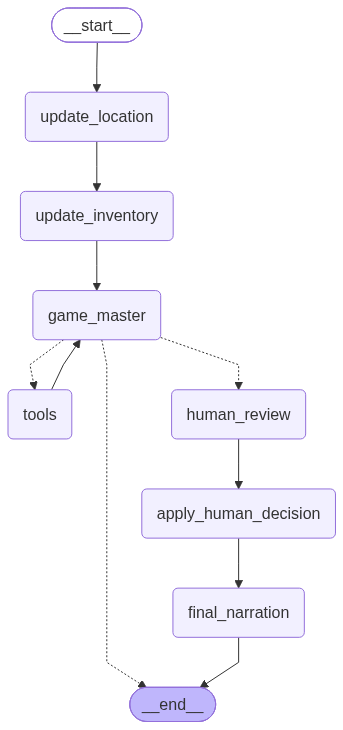
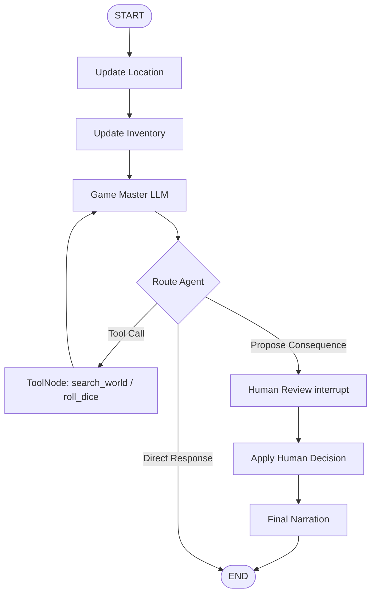
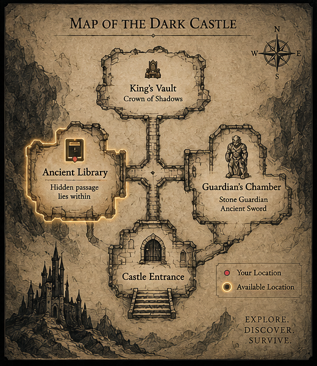

# Dark Castle: Stateful AI Agent & GenAI Framework

A stateful, Human-in-the-Loop (HITL) GenAI agent system built with **LangGraph**, **LangChain**, **Groq LLM**, **Chroma Vector Store**, and **Streamlit**. 

This project demonstrates production-grade agentic AI engineering patterns: deterministic state machine routing, dynamic Retrieval-Augmented Generation (RAG) grounding, autonomous tool selection, state checkpointing with session persistence, and human interrupt/resume safety controls.

---

## Key Features

* **Stateful Graph Architecture**: Implemented with LangGraph `StateGraph`, maintaining deterministic state transitions alongside LLM reasoning.
* **Retrieval-Augmented Generation (RAG)**: Dense vector retrieval using `Chroma` and `GoogleGenerativeAIEmbeddings` to enforce factual grounding against structured domain lore and rules.
* **Autonomous Tool Orchestration**: Dynamic routing to specialized tools for knowledge retrieval, stochastic event resolution (d20 rolls), and high-impact event proposals.
* **Human-in-the-Loop (HITL) Safety Controls**: Pauses graph execution using LangGraph's `interrupt()` primitive when major consequences occur (e.g., character death or item destruction), allowing humans to approve or override state changes via `Command(resume=...)`.
* **State Checkpointing & Thread Isolation**: Memory-backed state persistence (`MemorySaver`) tied to unique `thread_id` sessions for seamless continuation across multi-turn interactions.
* **Interactive Telemetry Dashboard**: Streamlit interface rendering real-time telemetry (health, location, inventory), interactive adventure logs, and HITL decision panels.

---

## Architecture & Workflow

The core architecture is built around a state machine (`StateGraph`) using `GameState` (a Pydantic `BaseModel`). Every user interaction triggers location updates, inventory state checks, LLM reasoning, conditional tool calling, and optional human override review.

### LangGraph State Machine Visual



### Execution Sequence Diagram



1. **State Pre-processing (`update_location` & `update_inventory`)**: Automatically parses player inputs against current game state and location restrictions before invoking the LLM.
2. **Reasoning Engine (`game_master`)**: Formulates decisions by binding system prompts with active state metrics and available tools.
3. **Conditional Routing (`route_agent`)**:
   - Routes to **`tools`** (`ToolNode`) when the agent invokes `search_world` or `roll_dice`.
   - Routes to **`human_review`** when the agent invokes `propose_consequence`.
   - Terminates at **`END`** when generating standard narrative responses.
4. **Human Review & Decision Application**: Suspends execution using `interrupt()`. Upon human resume (`approve` or `override:`), `apply_human_decision` deterministically updates state metrics before `final_narration` renders the outcome.

---

## Tech Stack

| Category | Technology / Library | Purpose |
| :--- | :--- | :--- |
| **Agent Orchestration** | LangGraph | State machine definition, conditional edges, HITL interrupts, checkpointing |
| **Framework** | LangChain / LangChain Core | Tool abstraction, message schema, prompt construction |
| **LLM Inference** | Groq (`ChatGroq`) | Fast inference using `openai/gpt-oss-20b` |
| **Vector Database** | Chroma (`langchain-chroma`) | In-memory vector store for domain knowledge retrieval |
| **Embeddings** | Google Generative AI (`models/gemini-embedding-001`) | Dense document embeddings |
| **State Validation** | Pydantic v2 | Strongly-typed `GameState` schema |
| **Frontend UI** | Streamlit | Web client, session state management, telemetry dashboard |
| **Configuration** | `python-dotenv` | Environment variable management |

---

## RAG Implementation

To eliminate hallucination and enforce domain boundaries, the system incorporates a RAG pipeline (`rag.py`):

1. **Document Loading**: Loads text files from `knowledge/`:
   - `knowledge/world.txt` (Locations & geography)
   - `knowledge/characters.txt` (NPC traits & stats)
   - `knowledge/rules.txt` (Game mechanics & d20 resolution tables)
2. **Text Chunking**: Chunked using `RecursiveCharacterTextSplitter(chunk_size=500, chunk_overlap=50)`.
3. **Vector Embedding**: Documents are embedded using `GoogleGenerativeAIEmbeddings(model="models/gemini-embedding-001")`.
4. **Retriever Integration**: Indexed into a Chroma vector store. The `search_world` tool queries the retriever (`k=3`) and injects factual context directly into the agent's context window.

```python
# rag.py snippet
def create_retriever():
    files = ["knowledge/world.txt", "knowledge/characters.txt", "knowledge/rules.txt"]
    documents = []
    for file in files:
        documents.extend(TextLoader(file).load())
    
    chunks = RecursiveCharacterTextSplitter(chunk_size=500, chunk_overlap=50).split_documents(documents)
    embeddings = GoogleGenerativeAIEmbeddings(model="models/gemini-embedding-001")
    vectorstore = Chroma.from_documents(documents=chunks, embedding=embeddings)
    return vectorstore.as_retriever(search_kwargs={"k": 3})
```

---

## Agent & Tool-Calling Flow

The `game_master` node is equipped with tools (`tools.py`) bound via `ChatGroq.bind_tools()`:

1. **`search_world(query: str)`**: Queries the Chroma vector store for factual rules, locations, or character lore.
2. **`roll_dice(request: str = "")`**: Generates a pseudo-random integer ($1 \le n \le 20$) for stochastic action resolution.
3. **`propose_consequence(event: str)`**: Signal tool that triggers the Human-in-the-Loop review pipeline when major events occur.

```python
# Prompt constraint snippet in graph.py
"""
You must ONLY use the game world, characters, items, locations, and rules 
provided by the game's knowledge base.

Use search_world whenever you need information about locations, characters, items, or rules.
Use roll_dice whenever an action requires a random outcome.
When a major consequence occurs, you MUST call propose_consequence with a clear description.
"""
```

---

## LangGraph State and Checkpointing

State management is central to keeping agent actions coherent over multi-turn interactions (`state.py`):

```python
class GameState(BaseModel):
    player_input: str = ""
    location: str = "Castle Entrance"
    player_hp: int = 100
    inventory: list[str] = Field(default_factory=list)
    context: list[str] = Field(default_factory=list)
    action: str = ""
    dice_roll: int = 0
    proposed_event: str = ""
    major_consequence: bool = False
    human_decision: str = ""
    messages: Annotated[list[BaseMessage], add_messages] = Field(default_factory=list)
```

- **State Merging**: Messages are appended deterministically via LangGraph's `add_messages` reducer.
- **Thread Checkpointing**: The graph is compiled with a `MemorySaver` checkpointer. Each session is configured with a unique `thread_id` UUID (`configurable: {"thread_id": "<uuid>"}`), preserving state history and enabling state rollback/resume.

---

## Human-in-the-Loop (HITL) Interrupt / Resume Flow

Safety controls are enforced through a pause-and-resume protocol when high-risk consequences occur:

1. **Detection**: `game_master` emits a tool call to `propose_consequence(event)`.
2. **Routing**: `route_agent` detects `propose_consequence` and routes execution to `human_review`.
3. **Interrupt**: `human_review` calls `interrupt({"type": "major_consequence", "event": consequence})`, freezing graph execution.
4. **User Action**: The UI renders a decision panel presenting the proposed event and options to **Accept Fate** or **Alter Fate**.
5. **Resumption**:
   - **Approve**: Invoked via `app.invoke(Command(resume="approve"), config=config)`.
   - **Override**: Invoked via `app.invoke(Command(resume="override: <custom action>"), config=config)`.
6. **State Resolution**: `apply_human_decision` parses the decision, updates `player_hp` or `inventory` deterministically, and passes control to `final_narration`.

---

## Project Structure

```
ai-game-agent/
├── app.py              # Streamlit Web UI, session management & telemetry dashboard
├── graph.py            # LangGraph StateGraph, nodes, routing, & MemorySaver checkpointer
├── state.py            # Pydantic GameState schema definition
├── tools.py            # LangChain tools (search_world, roll_dice, propose_consequence)
├── rag.py              # Vector store setup (Chroma + Google GenAI Embeddings)
├── knowledge/          # Grounding knowledge base
│   ├── world.txt       # Map locations & passage descriptions
│   ├── characters.txt  # NPC statistics & behavioral rules
│   └── rules.txt       # D20 resolution tables & HITL policies
├── assets/             # Architecture & UI visuals
│   ├── dark_castle_graph.png  # Compiled LangGraph visualization
│   └── dark_castle_map.png    # Interactive map visual used in UI
├── requirements.txt    # Project dependencies
└── .env                # API keys and environment configurations
```

---

## Setup and Installation

### Prerequisites

* Python 3.10+
* Groq API Key
* Google Gemini API Key

### Installation

1. **Clone the Repository**
   ```bash
   git clone https://github.com/your-username/ai-game-agent.git
   cd ai-game-agent
   ```

2. **Create and Activate a Virtual Environment**
   * Windows (PowerShell):
     ```powershell
     python -m venv venv
     .\venv\Scripts\activate
     ```
   * Linux/macOS:
     ```bash
     python3 -m venv venv
     source venv/bin/activate
     ```

3. **Install Dependencies**
   ```bash
   pip install -r requirements.txt
   ```

---

## Environment Variables

Create a `.env` file in the root directory with the following variables:

```env
GROQ_API_KEY=your_groq_api_key_here
GROQ_MODEL=openai/gpt-oss-20b
GEMINI_API_KEY=your_gemini_api_key_here
```

---

## How to Run

Launch the Streamlit web application:

```bash
streamlit run app.py
```

The application will launch in your browser at `http://localhost:8501`.

---

## Example Workflow & Usage

1. **Exploration & RAG Retrieval**:
   - Input: *"I search the room for hidden doors."*
   - Agent Action: Calls `search_world("hidden passage Ancient Library")` $\rightarrow$ retrieves secret door mechanics from `world.txt`.

2. **Action Resolution**:
   - Input: *"I attempt to steal the Ancient Sword."*
   - Agent Action: Calls `roll_dice()` $\rightarrow$ receives result (e.g., `4`). Checks `rules.txt` for stealing table ($1\text{--}9 = \text{Critical Failure}$).
   - Consequence: Stone Guardian wakes up and attacks.

3. **Human-in-the-Loop Intervention**:
   - Trigger: Agent calls `propose_consequence("The Stone Guardian attacks the player, dealing major damage.")`.
   - Graph State: Suspends execution via `interrupt()`.
   - UI Panel: Displays **"The Fate of This Moment"** dialog.
   - User Decision:
     - Click **Accept Fate**: Deducts HP and updates state.
     - Type *"The player ducked under the attack"* + Click **Alter Fate**: Overrides outcome and resumes narration safely.

---

## Map Visual



---

## Future Improvements

*(Labeled as planned enhancements for production scaling)*

* **Persistent Checkpointing**: Transition from in-memory `MemorySaver` to PostgreSQL / SQLite storage backends for long-term thread state persistence across server restarts.
* **Vector Store Persistence**: Replace in-memory Chroma instance with a persistent disk-backed Chroma client database to optimize cold boot initialization times.
* **Async Tool Execution**: Convert synchronous tool calls (`search_world`, `roll_dice`) to async execution (`atools`) for improved concurrency under load.
* **Evaluation Suite**: Implement structured agent benchmark tests using LangSmith for trajectory evaluation and hallucination monitoring.
